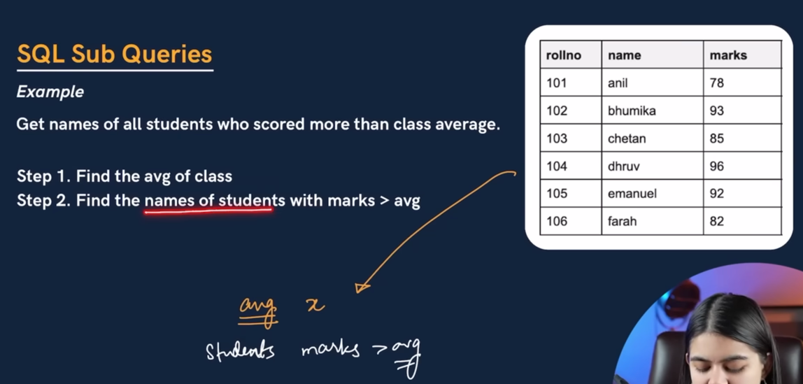
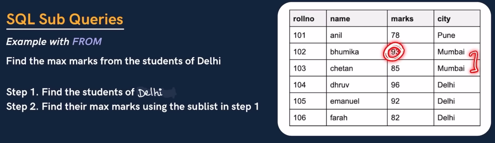
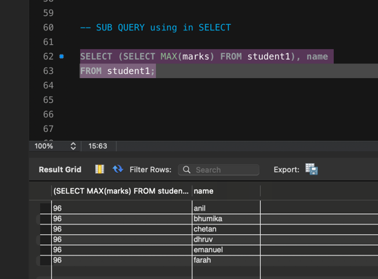

                    SQL SUB QUERY

            SUB QUERY using in FROM

-- SUB Query using in FROM. 

SELECT MAX(marks)

FROM (SELECT * 

FROM student1

WHERE city = 'Delhi') AS temp;

            SUB QUERY in SELECT
