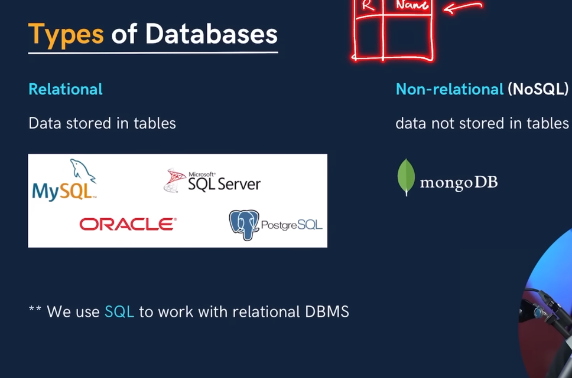
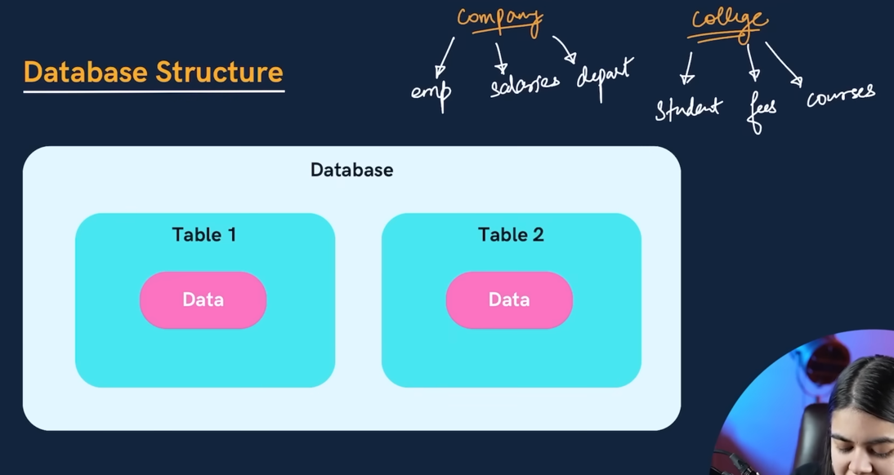
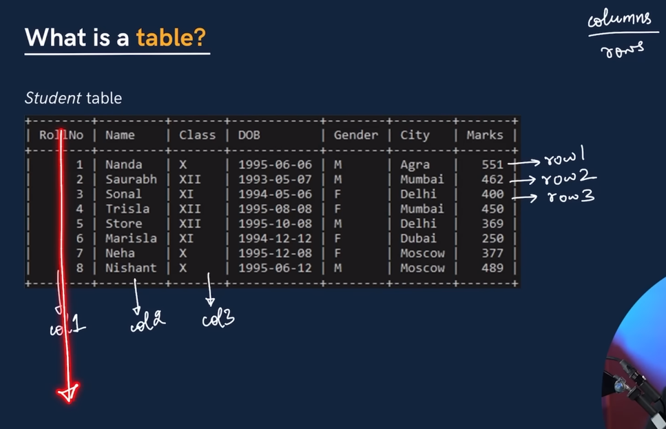
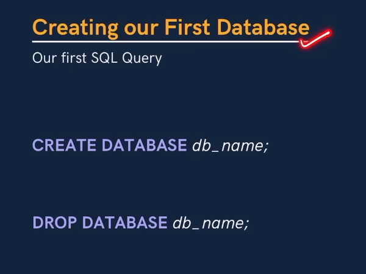
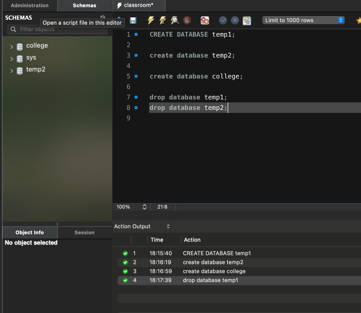
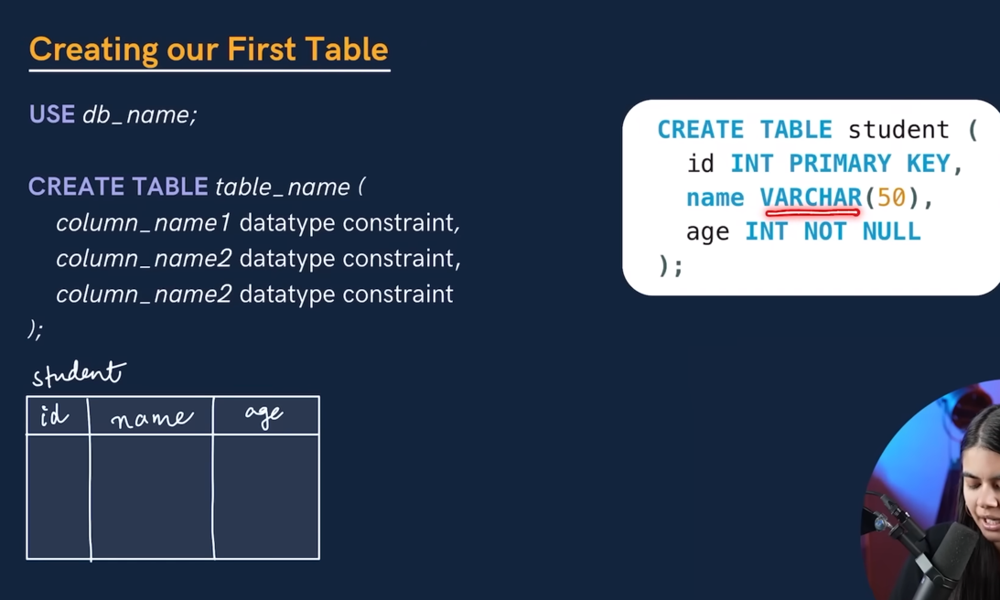
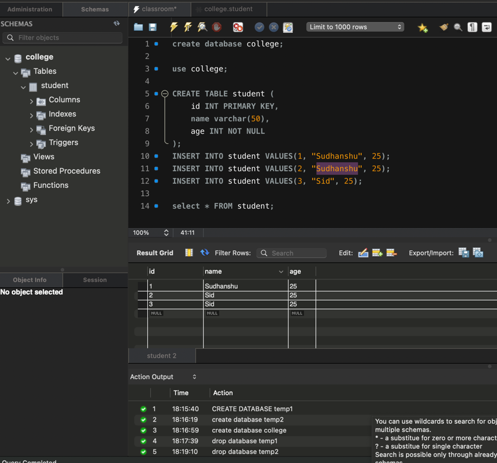

                    NOTES

Database: It is a **collection of data** in a format that can be easily 
accessed. (Digital)

DBMS: A software application used to manage our DB is called DBMS (Database
Management System)

Types of Databases
1) Relational DBMS
2) Non-Relational DBMS

What is SQL?

Structured Query Language - it is a programming language used to interact with the relational databases. 

It is used to perform CRUD operations.

CREATE
READ
UPDATE
DELETE
-----------

## Database Structure

What is a TABLE?

From columns, we get to know about the structure or SCHEMA.

rows: It tells us about the individual data 
columns : It tells us about the structure/schema (design)

SCHEMA (Design of the database)

-----

#### CREATE A DATABASE

In order to use a specific database, we write 'use database_name'

-----
#### Creating a Table

--------

How to Insert the data 

INSERT INTO student VALUES(1, "Sudhanshu", 25);
INSERT INTO student VALUES(2, "Sudhanshu", 25);

-------
How to print the table

select * FROM student;

