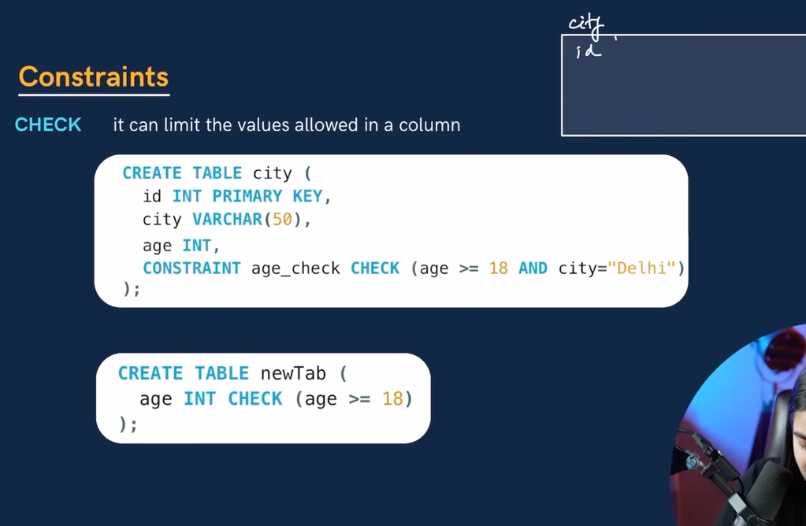

            Check Constraint

We can put a limit to any values in a col.

We have to write the constraint keyword and then the name of the constraint. (We can name it anything we would like to keep it.)

Then we put a condition like age should be more than 18  and the city name should be "delhi"

