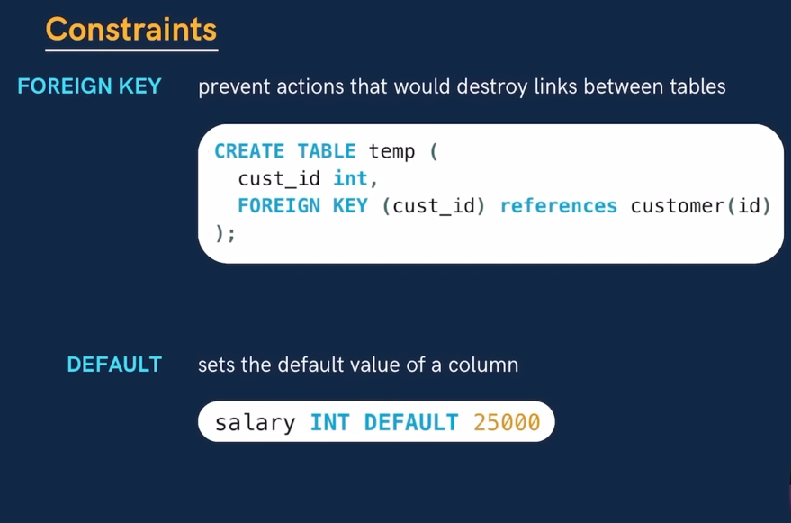
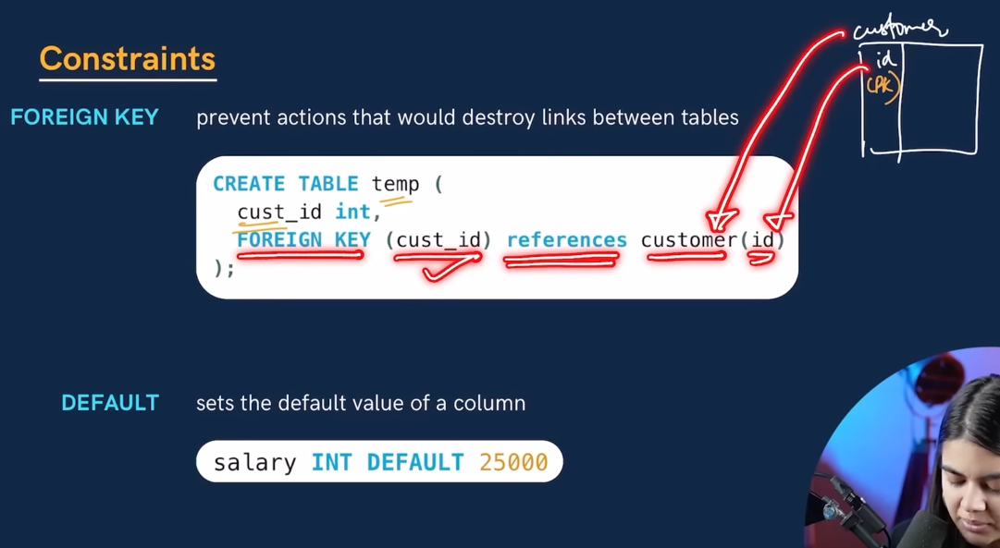

Now in order to make a primary key.

Let's suppose, we have two tables that and we are making one col as a foreign key

Foreign key : It is a primary key of another table that acts like a link.

Now In order to declare that : 

we type FORIGN KEY (col_name)

references table_name (id) : this refers to the primnary key. 

Here table_name is important and then we need to specify which key is the primary key of that table.

DEFAULT : sets the default value of the column.

Salary INT DEFAULT 25000

If you see we have defined salary as a default and we didn't have to insert the value for the salary. It is there by default. 

