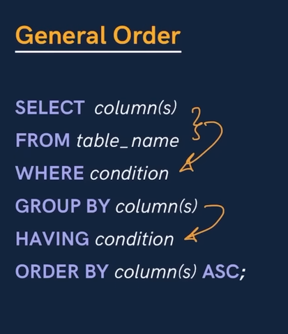

                HAVING CLAUSE

Having clause is used to apply condition on after grouping. 

WHERE clause is similar, but it is used to apply condition on rows instead.

General Order to write the SQL query.

SELECT column(s)

FROM table_name

WHERE condition (for the row)

GROUP BY column(s)

HAVING condition (after grouping)

ORDER BY column(s) ASC;

