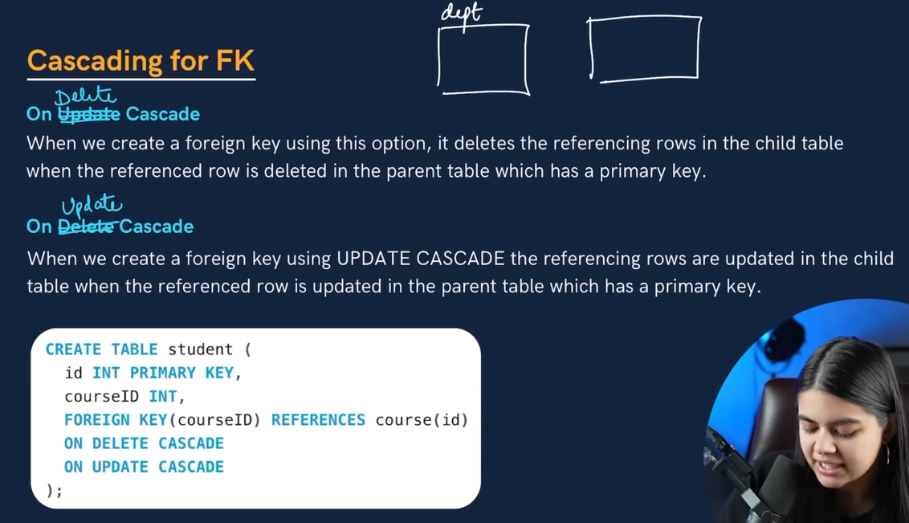
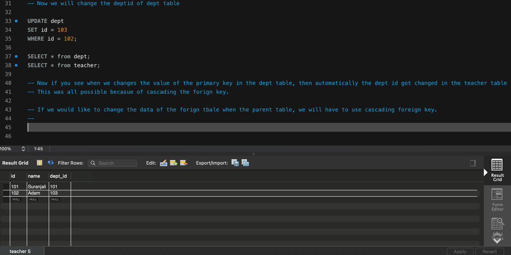

            CASCADING FOR FK KEY

Meaning of Cascading: If there is a change at one place.
Then there will be change at the second place. 

use college;

create table teacher

	(id int primary key,

    name varchar(50),

    dept_id INT,

    FOREIGN KEY (dept_id) REFERENCES dept(id)

    ON UPDATE CASCADE 
    ON DELETE CASCADE

);

-- For example: 

INSERT INTO dept

VALUES

(101, "english"),

(102, "IT");

SELECT * from dept;
K

INSERT INTO teacher

VALUES

(101, "Suranjali", 101),

(102, "Adam", 102);

SELECT * from teacher;

DROP table teacher;

-- Now we will change the deptid of dept table

UPDATE dept

SET id = 103

WHERE id = 102;

SELECT * from dept;

SELECT * from teacher;

-- Now if you see when we changes the value of the primary key in the dept table, then automatically the dept id got changed in the teacher table.

-- This was all possible becasue of cascading the forign key.

-- If we would like to change the data of the forign table when the parent table, 
    we will have to use cascading foreign key.

