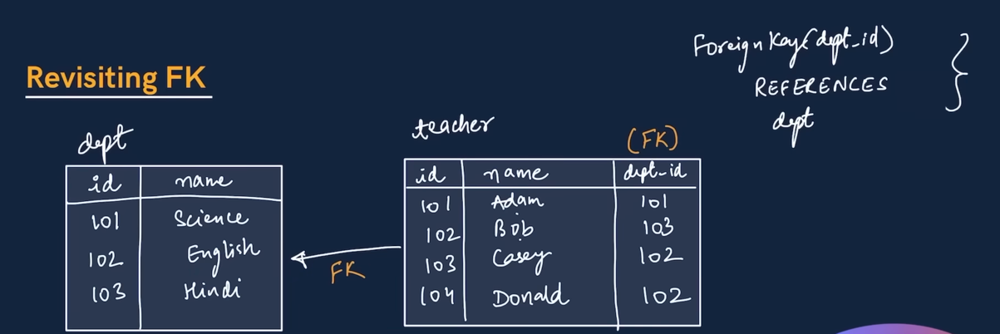
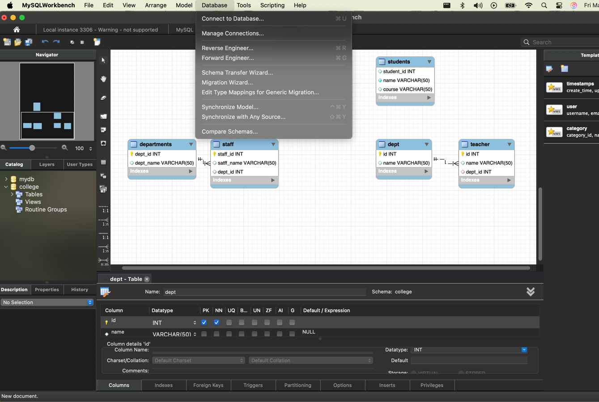

                FOREIGN KEYS

REVISITING FK

First We are going to create the tables, then perform a reverse engineering on the database.

SELECT DATABASE > REVERSE ENGINEERING

The dept table will be parent as we have specified the primary key in the 
dept table.

The teacher table will be a child table as we have specified the foreign key in the 
teacher table.

