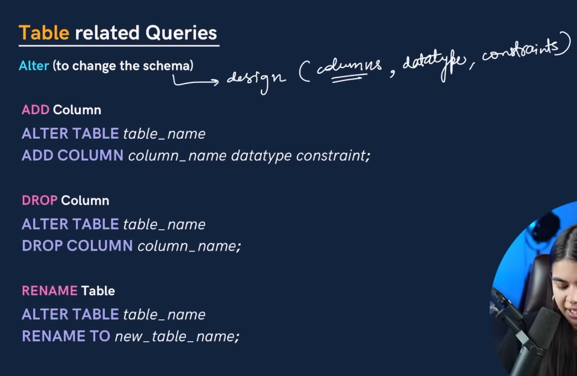
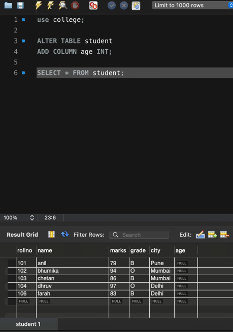
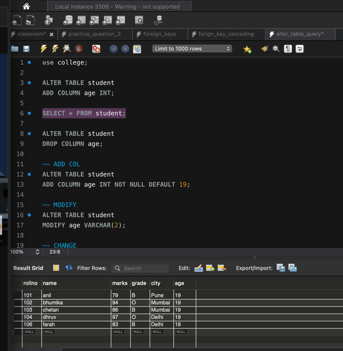
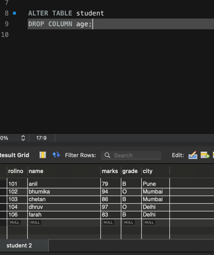
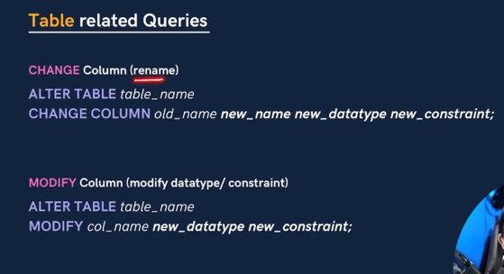
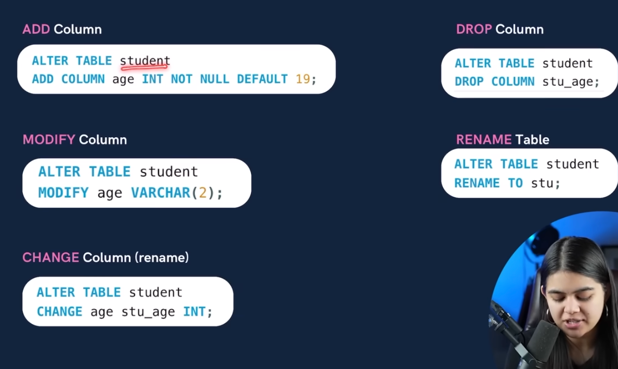

        ALTER TABLE

It is used to change the SCEHMA (Design of the database)

There are many functionality in the ALTER TABLE

1) ADD

2) DROP 

3) RENAME table

4) CHANGE Column (rename)

5) MODIFY Column (rename)

