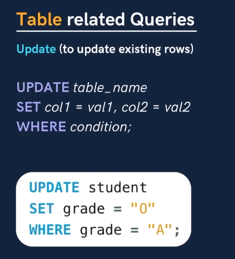
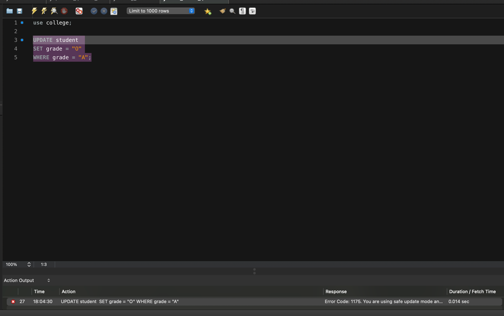
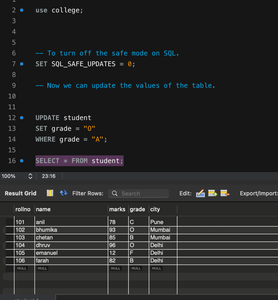
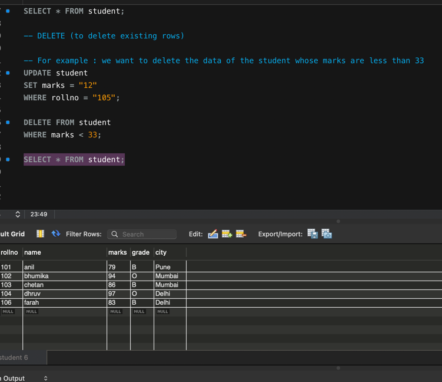

            TABLE RELATED QUERIES 

Update Operation: (to update the existing rows)

UPDATE table_name
SET col1 =val1, col2 = val2
WHERE condition;

For exammple: 

In the student table from college database :

We would like to change the grade from "A" to "O". Then we would have to 
update the values of the cols in the table. For that, we would have to use the update method. 

If you see this error message : Error code: 1175

In MYSQL, there is a safe mode in order to prevent any big changes to the
database due to security reasons.

We would have to type a cmd to turn it off. 

SET SQL_SAFE_UPDATES = 0

                DELETE FROM QUERY

In order to delete any data from the rows, we can use DELETE.

