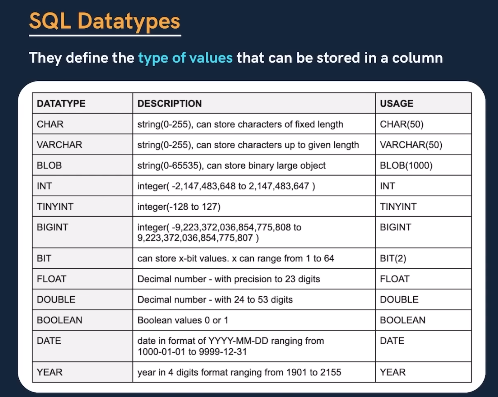
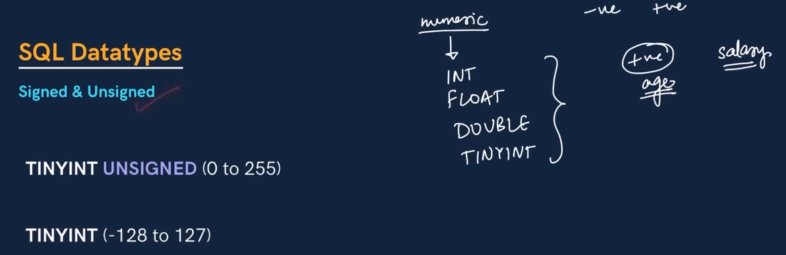

                            # NOTES

SQL DATATYPES

Let's assume that we have a col1 and the datatype is CHAR(50)
It will use that much space in the momory which is filled and the other memory allocation will be free.

VARCHAR (50) :If we set a limit of VARCHAR to 50, then we it will take the input data and store that much in the memory. 
                There is no resveration, For example: if we have saved city_name with 'Delhi', It will save DELHI in the memory only.

BLOB : It can store big binary objects

INT - To store integers.
TINYINT -Short form of INT
BIGINT - Big form of INT

BIT : Either we can store 0  or 1

FLOAT : Decimal numbers - with precisons to 23 digits.

DATE: for saving dates
YEAR : To save YEAR

-------

