                    JOINS IN SQL

Join is used to combine rows from two or more tables, based on a 
related column between them.

 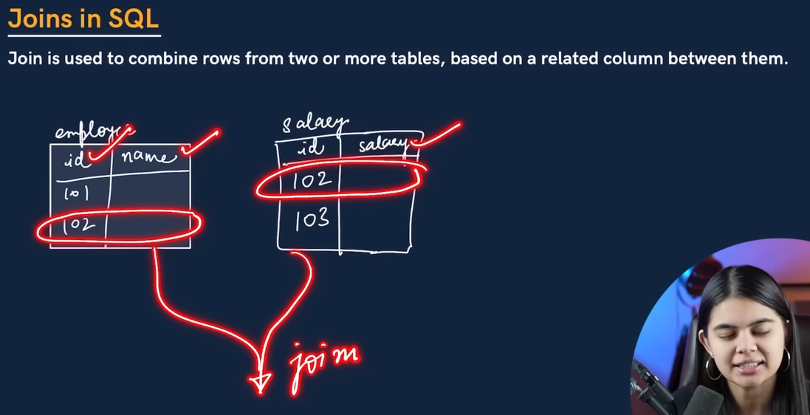
 
We can use join where the FK is availble but it is not mandatory.

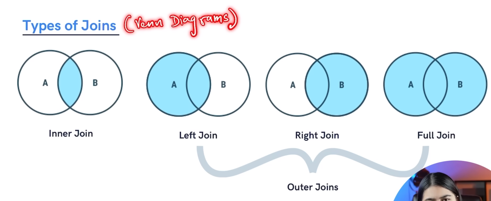

INNER JOIN : You will get the common data from this join.

If we need the common data from any two or more tables, we can use inner join.

OUTER JOIN: There are three types
1) Left JOIN: It will extract the data from A table, and common data between A and B.
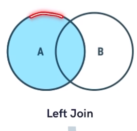
2) RIGHT JOIN : It will extract the data from B table, and common data between A and B.
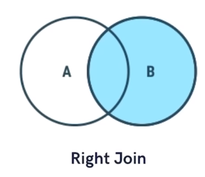
3) FULL JOIN : I will have all the data from A and B Table. 
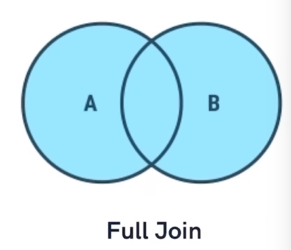

-----------------

                    INNER JOIN

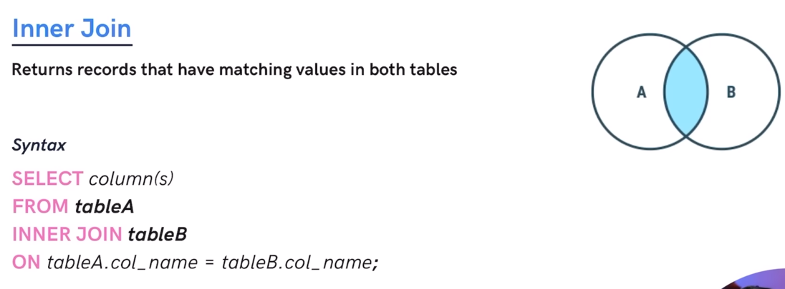

SYNTAX: 

SELECT COLUMN_NAME

FROM TABLEA

INNER JOIN TABLEB

ON TABLEA.col_name = TABLEB.col_name;

EXAMPLE: 

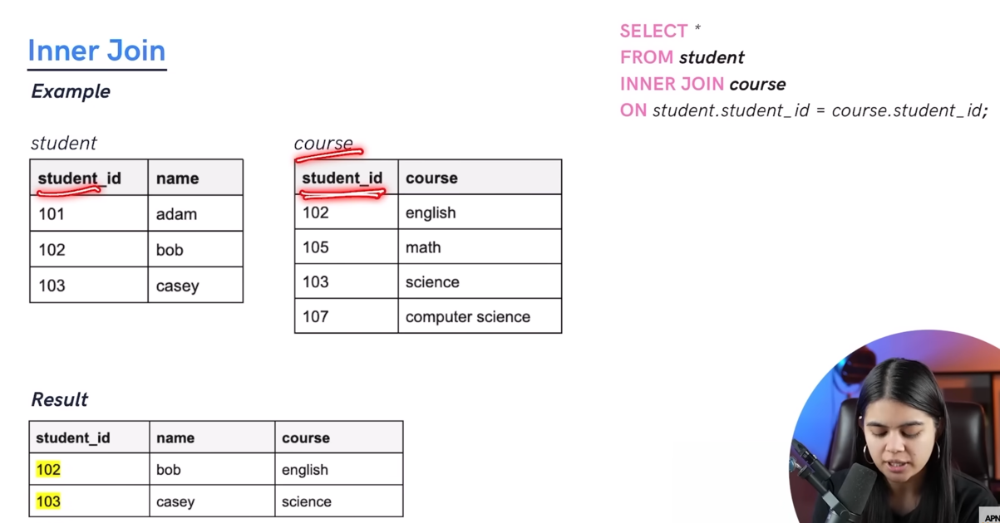

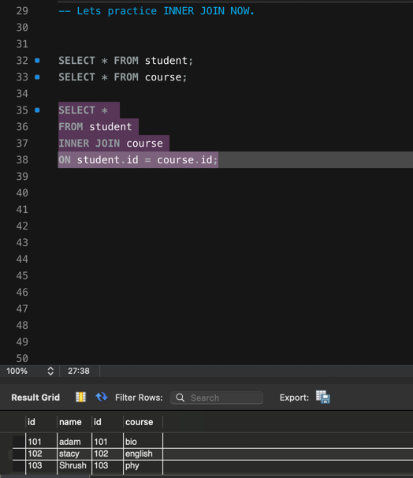

We can also use ALIAS to create shortform.

Like: 
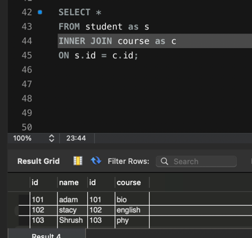

                LEFT JOIN

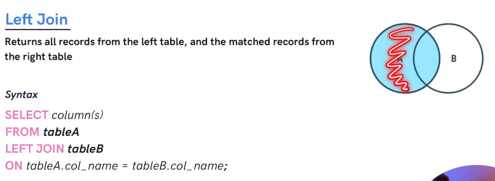

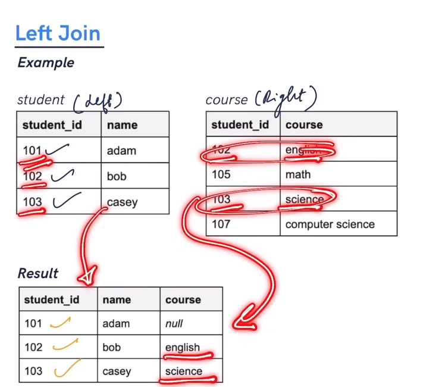

                RIGHT JOIN 
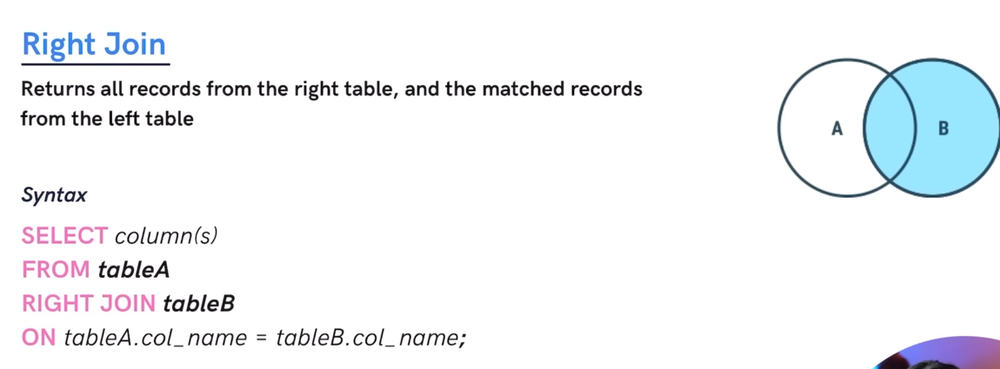
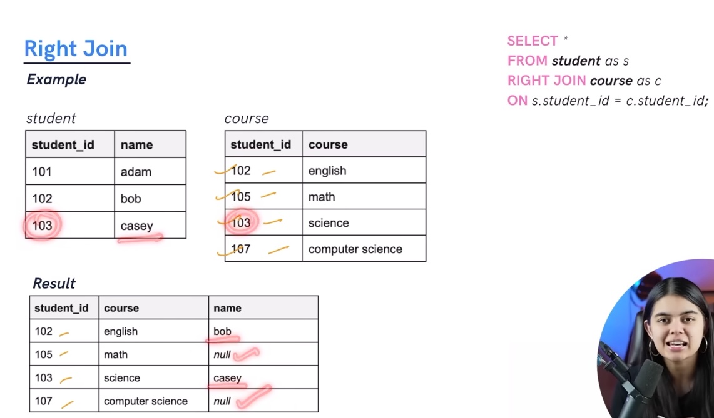

                FULL JOIN

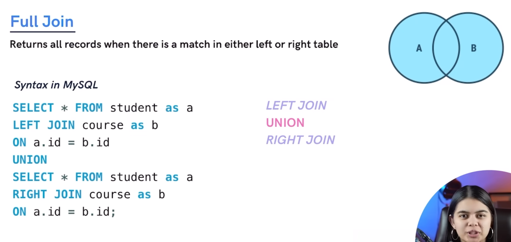

We don't have full join in MYSQL, so we need to use LEFT JOIN and RIGTH JOIN

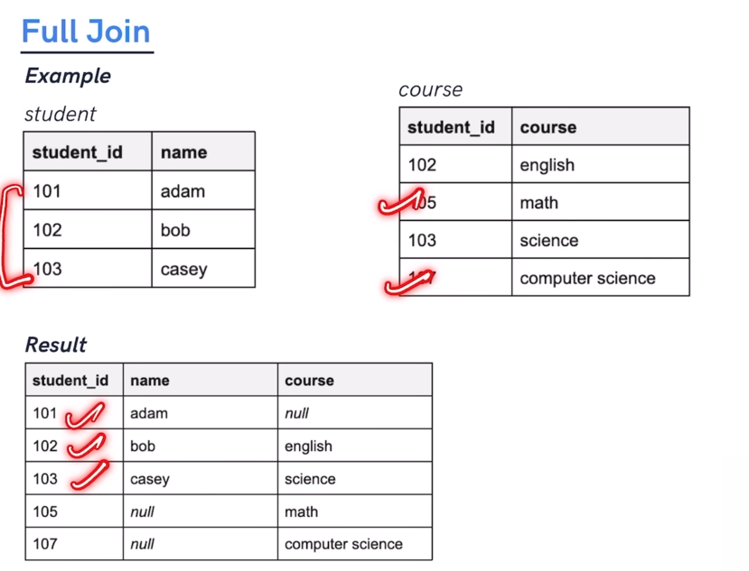

            LEFT AND RIGHT EXCLUSIVE JOIN
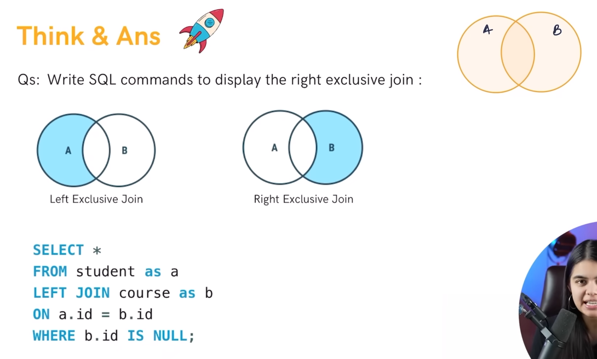

